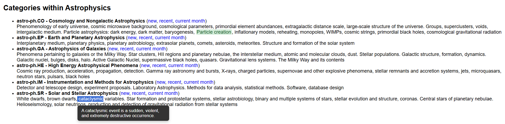
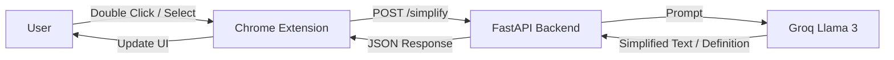

# LexiSwap AI

LexiSwap AI is a Chrome Extension that performs context-aware lexical simplification for scientific and academic text. It uses a FastAPI backend powered by Groq (Llama 3) to provide accurate simplifications.



## Features
- **Context-Aware Simplification**: Analyzes surrounding text to maintain semantic meaning.
- **Double-Click Magic**: 
    - **Double-click** any word to instantly swap it for a simpler synonym.
    - **Double-click** a simplified word to revert it to the original.
- **Selection Tooltip**: Select any text to see options:
    - **Swap **: Simplify the selected text.
    - **Meaning **: Get a concise definition.
- **Simplicity Levels**: Choose between Basic, Intermediate, and Advanced via the popup.
- **Local Caching**: Minimizes API calls for repeated words.
- **Non-Intrusive UI**: Shadow DOM tooltip appears near the cursor.

## System Architecture



## Setup Instructions

### 1. Backend Setup
The backend runs locally on port 8000.

1.  Navigate to `fastapi-backend`:
    ```bash
    cd fastapi-backend
    ```
2.  Install dependencies:
    ```bash
    pip install -r requirements.txt
    ```
3.  Ensure your `.env` file has the correct Groq API key (already configured).
4.  Start the server:
    ```bash
    uvicorn main:app --reload
    ```

### 2. Extension Setup
1.  Open Chrome and go to `chrome://extensions`.
2.  Enable **Developer mode** (top right).
3.  Click **Load unpacked**.
4.  Select the `d:\Word_swap\chrome-extension` directory.

## Troubleshooting
- **No Highlight?** Ensure the backend is running and you have refreshed the page after installing the extension.
- **API Error?** Check the terminal for error logs.
